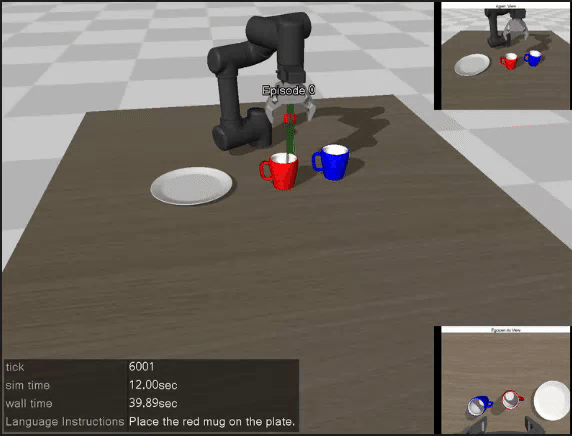
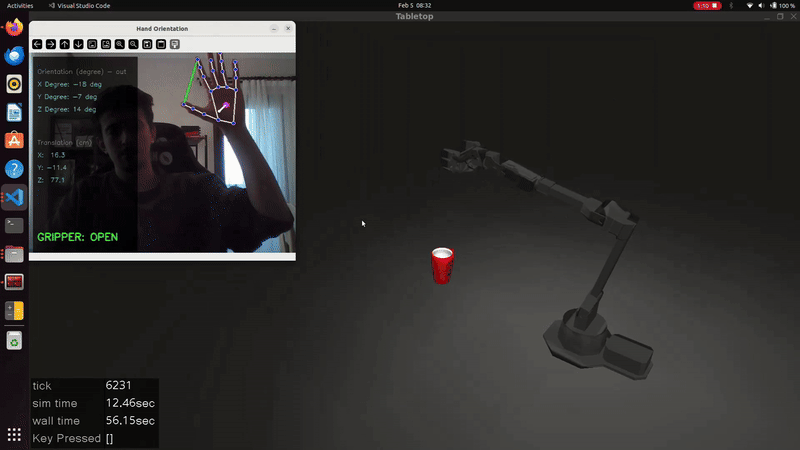

# Embodied AI

This repository contains research and notes on modern robotics frameworks and Embodied AI models, specifically focusing on **LeRobot** and **Vision-Language-Action (VLA)** architectures.

## 1. LeRobot: A Unified Framework for Robotics

**LeRobot** is an open-source framework developed by Hugging Face to provide a comprehensive set of tools for datasets, models, and simulation. Its primary mission is to **democratize and standardize** the robotics ecosystem.

### Traditional Control Stacks vs. LeRobot

| Feature | Traditional Modular Stack | LeRobot Approach |
| :--- | :--- | :--- |
| **Structure** | Sequential pipeline (Sensing → Planning → Control) | Unified/End-to-End |
| **Integration** | Separate modules for detection, IK, and path planning | Policy-based integration of all steps |
| **Logic** | Hand-coded algorithms and heuristics | Data-driven (Imitation/Reinforcement Learning) |
| **Input/Output** | Multi-stage data transformation | Sensor Data $\rightarrow$ Policy $\rightarrow$ Motor Command |

---

## 2. SmolVLA: Vision-Language-Action Architecture

**SmolVLA** is a state-of-the-art model that bridges the gap between digital reasoning and physical interaction.

### What makes it a VLA?
According to the research, a VLA is essentially a **VLM (Vision-Language Model) + an Action Expert**.

* **Sensorimotor States:** It processes multi-camera RGB feeds alongside the robot's internal states (like joint angles).
* **Action Expert:** This module translates high-level semantic features (e.g., "The cup is on the right") into low-level motor commands (velocity, torque).
* **Continuous Actions:** Unlike discrete text tokens, it produces smooth, real-valued outputs for fluid movement.

### Comparative Overview

| Model Type | Input | Output | Purpose |
| :--- | :--- | :--- | :--- |
| **LLM** | Text | Text | Digital reasoning & dialogue |
| **Vision** | Images | Labels / Segments | Spatial understanding |
| **VLA** | Image + Text + State | **Robot Actions** | Physical Embodiment & Interaction |

---

## 3. Environment Setup

To run inference and simulation, first create and activate the Conda environment:

    conda create -n lerobot_env python=3.10 -y
    conda activate lerobot_env

Then, install all required dependencies using the provided requirements.txt file:
    
    pip install -r requirements.txt

---

## 4. Simulation & Inference 

You can check out the full demo here: [Youtube](https://youtu.be/jtYhvCqHEVI)
In order to run inference, navigate to smolvla_project and run the command below: 

    python inference.py
> **Note:** Some file paths may need to be adjusted depending on your system configuration.
---

## 5. Teleoperating ViperX300s with Hand Landmarks

In order to control Viperx300s robot with hand landmarks, navigate to teleop_with_hand_gestures and run the command below: 
    
    python run.py
> **Note:** Some file paths may need to be adjusted depending on your system configuration.

## 🎥 I. Full Demo
You can check out the full demo of the pouring motion with the robotic arm here: [Youtube](https://www.youtube.com/watch?v=4zft4P67SN4)

## 🎥 II. Translation and Orientation Tests on Selected Axes
You can check out the axis-based motion tests of the robotic arm below: [Youtube](https://www.youtube.com/watch?v=zEXLi-rsG9Y)

---
## Technical Context
* **Simulation Environments:** MuJoCo.
* **Frameworks:** PyTorch, LeRobot.
* **Robotic Platforms:** OpenMANIPULATOR-Y, Trossen VX300s.
---

## Resources
* **LeRobot, SmolVLA:** [MuJoCo, Gazebo.](https://github.com/ROBOTIS-GIT/robotis_mujoco_menagerie)
* **MuJoCo:** [ROS 2, PyTorch, LeRobot.](https://github.com/ROBOTIS-GIT/robotis_mujoco_menagerie)
---

## Future Work
* **Camera Calibration**
* **Standardized Environment Variables**
* **Stereo Camera / RGB-D Point Cloud Data** 

